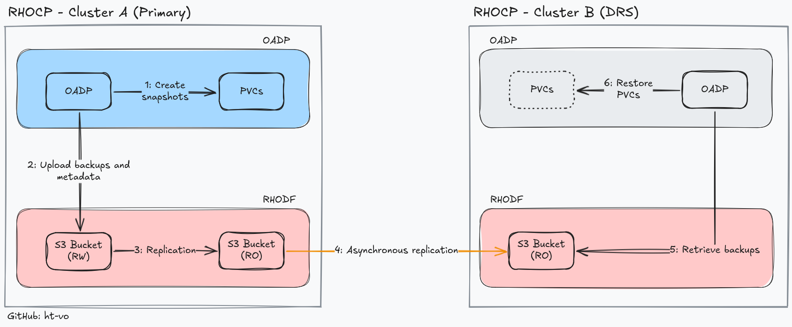

# OpenShift Multicluster Data Replication

The goal of the project is to demonstrate how to replicate S3 buckets between two OpenShift clusters using NooBaa and to orchestrate the backup and restoration of `PersistentVolumeClaims` through OADP.

## Requirements

* 2 Red Hat OpenShift Container Platform (RHOCP) clusters
* Red Hat OpenShift Data Foundation installed on both clusters
* Red Hat OpenShift APIs for Data Protection (OADP) operator on both clusters

## Tested Environment

This configuration was validated in both lab and production environments.

* **OpenShift Container Platform:** 4.18.22
* **OpenShift Data Foundation:** 4.18.10-rhodf
* **OADP Operator:** 1.4.5

## Diagram

## Getting Started

For detailed deployment steps, please refer to the **[usage guide](USAGE.md)**.

## License

This project is [MIT](LICENSE) licensed.
